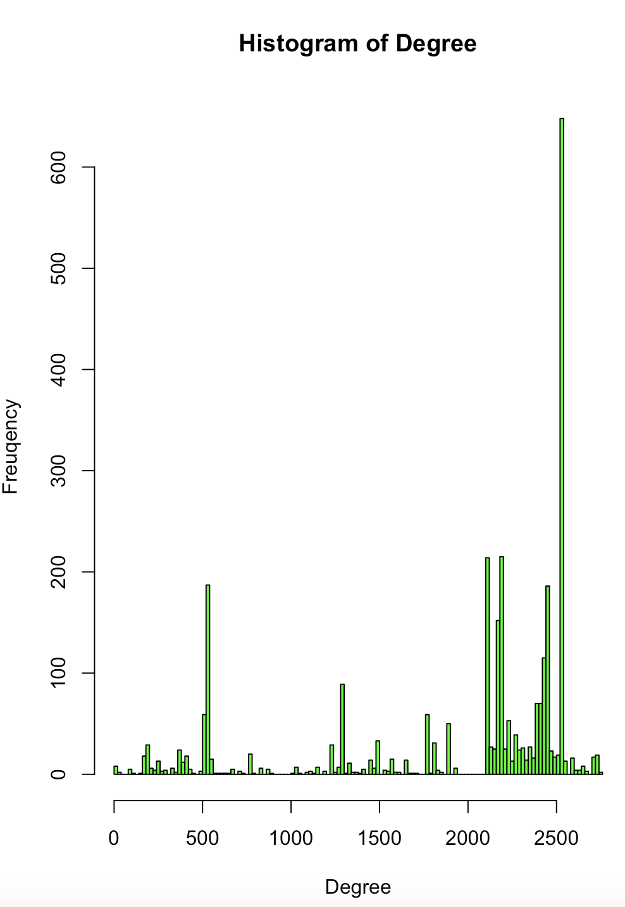
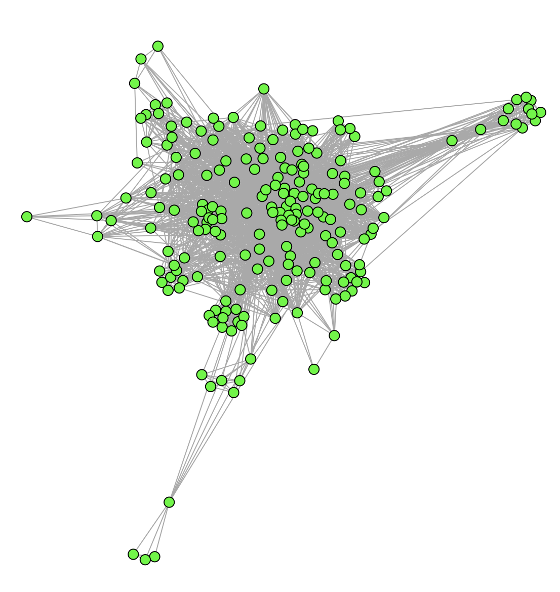

**The graph outputted based of tweet data indicates the following:-**

Sparse Connectivity: The majority of nodes have a low degree, indicated by the tall bars at the lower end of the degree axis. This suggests that most nodes have only a few connections.

Few Hubs: There are a few nodes with a very high degree (the tall bars towards the right end of the histogram). These could represent 'hub' nodes in the network, which have a large number of connections compared to others. This is typical of scale-free networks often observed in real-world networks like social networks or the internet.

Power Law Distribution: The overall shape of the histogram, with many nodes of low degree and few nodes of very high degree, hints at a power-law distribution which is common in natural and human-made systems.

Potential Outliers: The bars at the high-degree end might indicate the presence of outliers or anomalies in the network, which could be points of interest for further analysis, such as influential users in a social network.

Hence, in social media analysis, nodes with high degrees indicate few very influential users with many followers or someone who tweets very frequently, and hence and gets a lot of retweets.

